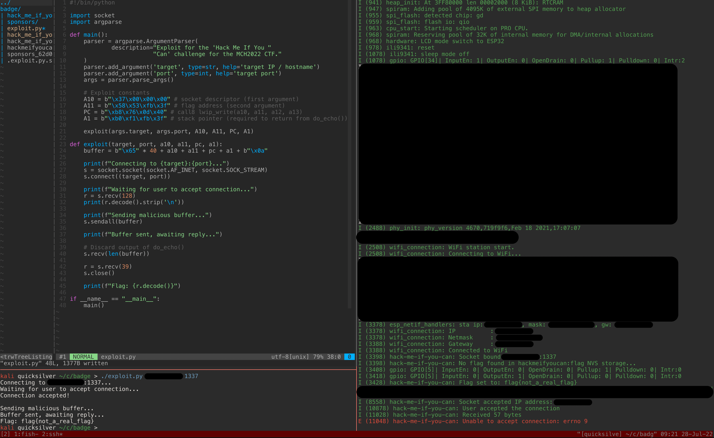

# mch2022-hack-me-if-you-can
Exploit for the MCH2022 CTF badge challenge ("Hack Me If You Can")

## Steps to exploitation:
1. Observe behaviour
   - Experiment with inputs.
   - Observe output via TCP and debug console.
   - Identify likely buffer overflow at inputs >48 bytes.
2. Analyze binary
   - Use Ghidra with an open source [Xtensa module](https://github.com/yath/ghidra-xtensa) for disassembly.
   - Determine that flag is read from non-volatile storage and copied to a
     fixed address.
3. Map execution flow
   - Observe that certain buffer sizes >48 bytes will trigger a `gdbstub`
     register dump to the debug console.
   - Use the register dump to follow execution flow in Ghidra and determine
     that the callee is `do_echo_recursive()` and caller is `echo_server()` at the
     time our return address gets loaded into the program counter.
   - Identify the offsets needed to set the return address (`a0`) and stack
     pointer (`a1`) of the callee's register window, and the registers `a10`
     and `a11` of the caller's register window.
4. Identify ROP gadget
   - Use Ghidra to identify a `call8` instruction to 
     `lwip_write(int socket, void* data, int size, int flags)`. We can use this
     instruction to send data back to our client. Note we can do this without
     any setup because a TCP connection already exists at the time we hijack
     execution flow.
5. Determine ROP gadget arguments
   - Use the register dump to observe that the socket descriptor (register a2
     in the `echo_server()` register window) is always the same (`0x37`) and
     likely deterministic. Set a10 (`socket` argument) to `0x37`.
   - Set a11 (`*data` argument) to the flag location we found earlier.
   - Observe that register a12 (`size` argument) is reliably set to a large
     value and does not need to be modified.
   - Observe that register a13 (`flags` argument), contains a non-zero value
     but nevertheless does not interfere with our call to `lwip_write()`.
6. Create malicious buffer and run exploit

## Proof

